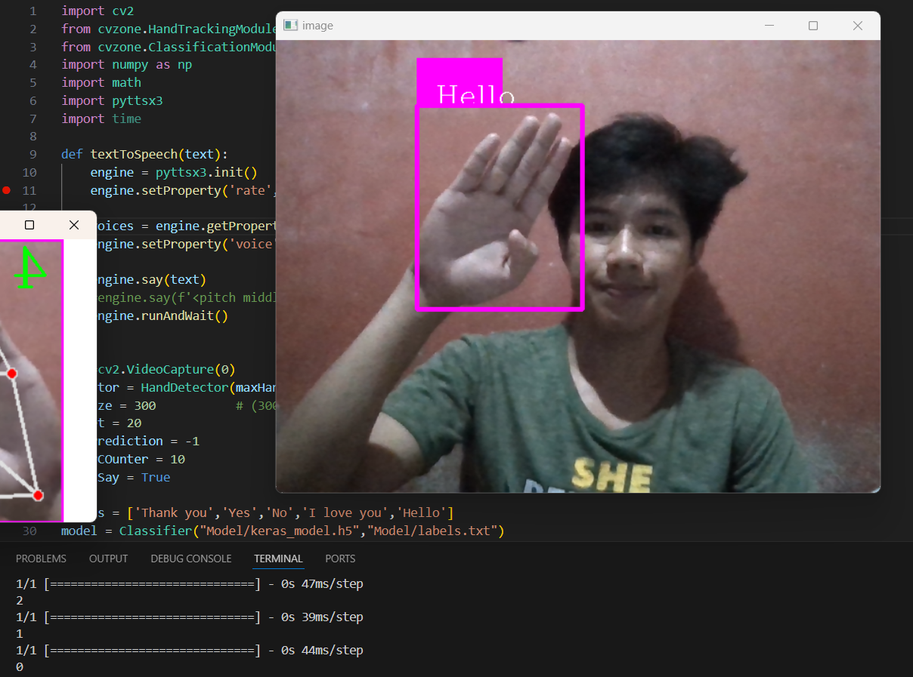
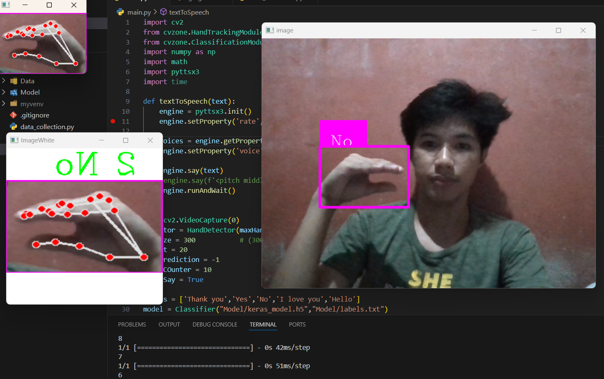

# Sign-Language-Recognition-with-text-to-speech
 
This is a sign language recognition program for ['hello','thank you','yes','no','i love you'] with a text-to-speech function.

## Sample images

## Credits 
[Murtaza's Workshop](https://www.youtube.com/watch?v=wa2ARoUUdU8)
